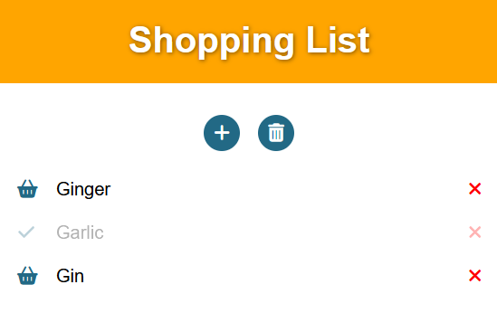

# Shopping List made with several JS frameworks

The very same shopping list SPA coded with several JavaScript frameworks in order to compare them with respect to developer experience and bundle size. The code can be found in the respective subfolders.

Vanilla JavaScript is also included. Strictly speaking, this is not a framework, but of course we need this as a reference here. As expected, Vanilla JavaScript has the smallest bundle size, but is a bit clumsy to write. The other frameworks here are sorted by their bundle size. The upshot is: **Svelte is really good, React is really bad.**

## Vanilla JavaScript

Demo: https://shopping-list-made-with-vanilla-js.netlify.app

Docs: https://developer.mozilla.org/docs/Web/JavaScript

For a proper comparison to the other frameworks, which all use build tools, I chose to use Vite here to build the app.

Size:
- HTML: 1.22 KB
- JavaScript: 2.70 KB
- CSS: 1.16 KB

## Svelte

Demo: https://shopping-list-made-with-svelte.netlify.app

Docs: https://svelte.dev/docs

Size:
- HTML: 681 B
- JavaScript: 9.16 KB
- CSS: 1.05 KB

## SolidJS

Demo: https://shopping-list-made-with-solid.netlify.app

Docs: https://www.solidjs.com/docs/latest

Size:
- HTML: 0.84 KB
- JavaScript: 12.98 KB
- CSS: 1.25 KB

## Lit

Demo: https://shopping-list-made-with-lit.netlify.app

Docs: https://lit.dev/docs/

Here I used Vite with the Vanilla preset and added the lit package afterwards. The Lit preset seems to only build the component.

Size:
- HTML: 2.59 KB
- JavaScript: 29.7 KB
- CSS: 0 KB (it's included in JS)

The CSS-In-JS doesn't look minified in the output, so one can get the size even smaller here.

## Vue

Demo: https://shopping-list-made-with-vue.netlify.app

Docs: https://vuejs.org/guide/

Size:
- HTML: 694 B
- JavaScript: 55.43 KB
- CSS: 1.40 KB

## React

Demo: https://shopping-list-made-with-react.netlify.app

Docs: https://reactjs.org/docs/getting-started.html

Size: 
- HTML: 896 B
- JavaScript: 142 KB
- CSS: 1.32 KB

## Features of the App
 
In each case the app has the following features:

1. component structure: App -> (Header, List -> Item)
2. button to add an item
3. focus on the input field of the new item
4. ability to change name of item
5. showing list of items - when there is at least one, otherwise show text 'add items'
6. button to delete the whole list after confirm - showing when there is at least one item
7. button to delete an item
8. buy button to buy/unbuy an item, which also toggles its icon
9. bought items are greyed out and their name cannot be edited
10. load items from local storage
11. automatic save items to local storage, debounced, when any change happens
12. several CSS styles and aria-labels for a11y